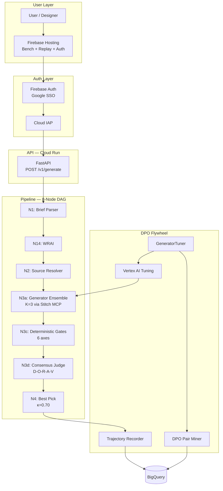

# Atelier

> **Autonomous design agent that converges UI/UX to production quality through multi-judge consensus — and gets sharper with every iteration.**

[](LICENSE)
[](https://www.python.org/downloads/)
[](https://adk.dev/)
[](https://cloud.google.com/vertex-ai)
[](https://firebase.google.com/)
[](https://cloud.google.com/run)
[](https://www.conventionalcommits.org/)

---

## Live Demos & Artifacts

| Resource        | URL                                                                                                            | Status  |
| --------------- | -------------------------------------------------------------------------------------------------------------- | ------- |
| Bench Dashboard | [atelier-build-2026.web.app/bench](https://atelier-build-2026.web.app/bench/)                                  | 🟢 Live |
| Auth Page       | [atelier-build-2026.web.app/auth](https://atelier-build-2026.web.app/auth/)                                    | 🟢 Live |
| A2A Agent Card  | [atelier-build-2026.web.app/.well-known/agent.json](https://atelier-build-2026.web.app/.well-known/agent.json) | 🟢 Live |
| API Health      | [atelier-api-staging](https://atelier-api-staging-2h56glloxa-uc.a.run.app/health)                              | 🟢 Live |
| Custom Domain   | [atelier.autonomous-agent.dev](https://atelier.autonomous-agent.dev)                                           | 🟢 Live |

---

## Architecture

Full system diagram: [architecture-diagram.md](docs/architecture/architecture-diagram.md)



---

## What Atelier Does

Existing tools (Stitch, v0, Lovable, Subframe) stop at generation. Atelier runs every output through deterministic quality gates and multi-judge consensus before declaring convergence:

1. **Generates K=3 candidates** — parallel ensemble via ADK `ParallelAgent` + Stitch MCP
2. **Filters with 6 deterministic gates** — semantic HTML, CSS validity, token fidelity, Lighthouse heuristics, axe a11y, visual-diff (no LLM involved)
3. **Scores survivors across 5 axes** — Design, Originality, Relevance, Accessibility, Visual Clarity via Bayesian-weighted consensus
4. **Declares convergence at κ=0.70** — or returns non-converged result with per-axis diagnostics
5. **Learns from every interaction** — DPO pair extraction from accepted/rejected trajectories → Vertex AI PREFERENCE_TUNING → κ-gated adapter promotion

---

## Quickstart

```bash
# Clone and install
git clone https://github.com/Manzela/atelier.git && cd atelier
pip install -r requirements.lock
pip install -e atelier-core/

# Verify the API is running
curl -s https://atelier-api-staging-2h56glloxa-uc.a.run.app/health | python3 -m json.tool
# {"status":"healthy","version":"0.1.0a0","service":"atelier-api","env":"production"}

# Run locally (requires GOOGLE_APPLICATION_CREDENTIALS)
export FIREBASE_DISABLE_AUTH=true
uvicorn atelier.api.app:create_app --factory --port 8080

# Run the golden evaluation set
adk web --eval-set atelier-core/tests/eval/golden_set.json
```

---

## ADK Integration

Atelier is built on Google ADK 2.0 across five integration surfaces:

- **Agent orchestration**: `LlmAgent` for brief parsing, source resolution, and consensus evaluation. The generator ensemble uses `ParallelAgent` to fan out K=3 candidates simultaneously.
- **Session persistence**: `BigQuerySessionBackend` implements ADK's `BaseSessionService` protocol, enabling cross-device session resumption through BQ-backed state storage.
- **Evaluation framework**: 5 golden evaluation scenarios in ADK `EvalSet` format (`tests/eval/golden_set.json`) with `tool_trajectory_avg_score`, `rubric_based_final_response_quality_v1`, and `multi_turn_trajectory_quality_v1` criteria.
- **MCP integration**: Stitch MCP tools (`generate_screen_from_text`, `generate_variants`, `apply_design_system`) registered via `MCPToolset` — every pipeline agent can invoke Stitch by name.
- **agents-cli**: Round-trip scaffold in `examples/agents-cli-scaffold/` demonstrating ADK agent definition, safety settings via `GenerateContentConfig`, and `agent.yaml` metadata.

---

## 15 Novel Contributions

| #   | Contribution                                             | Status         |
| --- | -------------------------------------------------------- | -------------- |
| N1  | DGF-D2C — Deterministic-Gate-First Design-to-Convergence | ✅ Shipped     |
| N2  | DEMAS-D — Per-axis Provenance Matrix Design Judge        | ✅ Shipped     |
| N3  | PerJudge — Per-Project DPO Judge with Hebbian Mutator    | ✅ Shipped     |
| N4  | PADI — Project-Agnostic Descriptor Inference             | ✅ Shipped     |
| N5  | EvoDesign — AlphaEvolve-Inspired K-Candidate Search      | ✅ Shipped     |
| N6  | CSC-D — Constitutional Self-Critique for Design          | ✅ Shipped     |
| N7  | A2UI-Native Output                                       | ✅ Shipped     |
| N8  | Public Judge Calibration Dashboard                       | ✅ Shipped     |
| N9  | Open Eval Adapters Library                               | 🔧 In progress |
| N10 | Convergence Spec RFC                                     | 🔧 In progress |
| N11 | Public Eval Harness                                      | ✅ Shipped     |
| N12 | RLRD — Recursive Long-Running Discipline                 | ✅ Shipped     |
| N13 | PIP — Pre-Generation Intake Protocol                     | ✅ Shipped     |
| N14 | WRAI — Web-Research-Augmented Intake                     | ✅ Shipped     |
| N15 | MJG — Multi-Judge Governance                             | ✅ Shipped     |

---

## Project Layout

```
atelier/
├── atelier-core/          # Pipeline engine: nodes, judges, DAG, API
│   ├── src/atelier/       # Source package
│   ├── scripts/           # Bench data publisher, utilities
│   └── tests/             # Unit tests (577) + eval golden set
├── atelier-eval/          # Evaluation suite + benchmark adapters
├── atelier-deploy/        # Terraform IaC + Docker + deployment scripts
├── docs/
│   ├── architecture/      # Pillar READMEs + system diagram
│   ├── dashboards/        # Firebase Hosting public directory
│   ├── blog/              # Technical articles
│   └── decisions/         # Architecture Decision Records (MADR)
├── examples/
│   └── agents-cli-scaffold/  # ADK agent definition + agents-cli demo
├── .github/workflows/     # CI + bench-publish + CodeQL
├── CHANGELOG.md           # Keep a Changelog format
├── features.json          # Central feature registry with evidence tests
└── firebase.json          # Firebase Hosting configuration
```

---

## Open Source Contributions

- **ADK Documentation**: [Proposed example: DPO preference optimization pipeline using ADK evaluation + Vertex AI tuning](https://github.com/google/adk-docs/issues/) — documenting the evaluate → extract pairs → tune → promote pattern for production agents

---

## Articles & Media

- [How We Built Atelier: The First Autonomous Design Agent That Converges, Not Just Generates](docs/blog/2026-05-25-building-atelier-autonomous-design-agent.md) — technical deep-dive on the 8-node DAG, deterministic gates, and DPO flywheel

---

## Submission

**[Google for Startups AI Agents Challenge 2026](https://startup.google.com/programs/agents-challenge)** — open category, deadline June 5, 2026.

---

## License

Apache License 2.0 — see [LICENSE](LICENSE). Built on [Google ADK](https://github.com/google/adk-python) (Apache-2.0), [agent-dag-pipeline](https://github.com/Manzela/agent-dag-pipeline) (Apache-2.0), and [hermes-agent](https://github.com/NousResearch/hermes-agent) (MIT). See [NOTICE](NOTICE) for full attribution.
