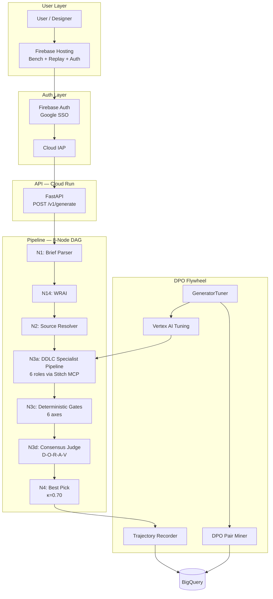

# Atelier

> **Autonomous design agent that converges UI/UX to production quality through multi-judge consensus — and gets sharper with every iteration.**

[](LICENSE)
[](https://www.python.org/downloads/)
[](https://adk.dev/)
[](https://cloud.google.com/vertex-ai)
[](https://firebase.google.com/)
[](https://cloud.google.com/run)
[](https://www.conventionalcommits.org/)

---

## Live Demos & Artifacts

| Resource        | URL                                                                                                            | Status |
| --------------- | -------------------------------------------------------------------------------------------------------------- | ------ |
| Bench Dashboard | [atelier-build-2026.web.app/bench](https://atelier-build-2026.web.app/bench/)                                  | Live   |
| Auth Page       | [atelier-build-2026.web.app/auth](https://atelier-build-2026.web.app/auth/)                                    | Live   |
| A2A Agent Card  | [atelier-build-2026.web.app/.well-known/agent.json](https://atelier-build-2026.web.app/.well-known/agent.json) | Live   |
| API Health      | [atelier-api-staging](https://atelier-api-staging-2h56glloxa-uc.a.run.app/health)                              | Live   |
| Custom Domain   | [atelier.autonomous-agent.dev](https://atelier.autonomous-agent.dev)                                           | Live   |

---

## Architecture

Full system diagram: [architecture-diagram.md](docs/architecture/architecture-diagram.md)



---

## Why Atelier?

The #1 complaint across design-generation tools is not raw capability — it is legibility, control, and trust. Users cannot tell why an output was accepted, cannot see what tokens burned, cannot edit without regenerating from scratch, and get designs that drift off their brand. Invisible token burn is the top usage complaint across Stitch, v0, and Lovable.

### Comparison

| Capability                | Stitch / v0 / Lovable                  | Claude Design (Anthropic Labs, research preview)                                  | Atelier                                                                                                                             |
| ------------------------- | -------------------------------------- | --------------------------------------------------------------------------------- | ----------------------------------------------------------------------------------------------------------------------------------- |
| Execution model           | Synchronous, one-shot generation       | Synchronous, human-collaborative single-model editor                              | Autonomous and long-running; unattended convergence                                                                                 |
| Architecture              | Single LLM pass                        | Single model with design-system authoring + export                                | Multi-specialist 8-node DAG; 6-role DDLC specialist pipeline + Fixer convergence loop                                               |
| Garbage / skeleton output | No structural floor; returns skeletons | No explicit skeleton gate                                                         | Deterministic structure gate: reject+halt on skeleton — REJECTED before the LLM judge sees it                                       |
| Design-system fidelity    | Tokens suggested, often drifted        | Builds and APPLIES a design system; custom knobs                                  | Zero-tolerance token gate: anchored tokens propagated and verified across every surface                                             |
| Editing model             | Regenerate-not-edit                    | Interactive WYSIWYG refinement; high visual fidelity                              | One-edit -> N-surface token propagation (AT-052); byte-stable replay                                                                |
| Token / credit visibility | Opaque                                 | Session-scoped, not user-legible                                                  | Legible per-user token meter; token-based governance model with fail-closed gates (deploy wave: live per-user 5M-token cap + meter) |
| Proactive standards       | Prompt-literal                         | Proactive; reads codebase; exports HTML/Canva/PPTX; handoff bundle to Claude Code | Scope-lock + proactive standards check before generation starts                                                                     |
| Multi-judge consensus     | None                                   | None                                                                              | 5-axis D-O-R-A-V judge panel with axis-weighted composite; oracle-score deltas visible per iteration                                |
| Observability             | None                                   | None                                                                              | Per-iteration scorecard + byte-equal replay (live); Kanban board (deploy wave)                                                      |
| Governance                | None                                   | None                                                                              | Fail-closed gates, converge-or-halt discipline, human sign-off (live in this repo); Model Armor + IAP auth (deploy wave)            |
| Cloud-native              | Vendor-neutral                         | Anthropic / Claude                                                                | Google-native: Vertex AI + Gemini + BigQuery + Cloud Run + Firebase                                                                 |

Governance items marked "(deploy wave)" are designed, ADR-tracked, and implemented in the GCP operator layer; the fail-closed gates, converge-or-halt loop, and human sign-off discipline are live in this repo today and verifiable by cloning.

**Honest read on Claude Design:** Claude Design out-polishes Atelier on raw visual fidelity, interactive-refinement feel, output breadth, and real adoption — it is a flagship-vision-model WYSIWYG editor. Atelier does a different job: autonomous, governed, multi-surface design-system generation. Atelier does not attempt to clone or out-polish Claude Design. The beat is autonomy + governance + a verifiable system.

### Measurable B1 proof-points (reproducible in this repo)

- **Skeleton reject+halt**: the deterministic structure gate rejects empty/skeleton HTML before the consensus judge runs. No LLM token is burned on garbage input.
- **One-edit -> N-surface token propagation** (AT-052): editing a single design token propagates byte-stably across all surfaces; the Studio iframe renders the sentinel color verbatim from `srcDoc`.
- **Converging oracle-score deltas** (AT-093): per-iteration D-O-R-A-V scorecard shows numerical advance from iteration 1 to iteration 2 with a documented failing axis at each step.
- **Byte-stable replay**: the same brief produces the same converged HTML byte-for-byte across runs.

---

## Business case

### Unit economics (B2)

Atelier's cost basis is **tokens, not dollars** — the live meter shows `used / 5,000,000` per user (input, output, and thinking tokens split), never a dollar figure in-product. The token model:

- **One bounded design system per run.** Every run terminates at a deterministic stop reason (converged at κ=0.70, max-iterations, or the per-user cap), so the token spend per design system has a known ceiling rather than an open-ended chat.
- **No tokens on garbage.** The deterministic structure gate rejects empty or skeleton input before any judge runs, so the model is never billed for work the gates would reject.
- **Enforced, not applied, consistency.** Brand fidelity is a zero-tolerance deterministic gate (AT-012): off-token output cannot pass on judge scores alone. Competitors apply a brand probabilistically; Atelier guarantees it — a reproducible difference (drive a single off-token edit and watch the gate REJECT it).

The dollar narrative stays in prose: at the documented serving cost the per-design-system token budget maps to a predictable unit cost, while the product surfaces the governable quantity — tokens — that the operator actually controls.

### Open-source and freemium GTM (B3)

- **V1 — clone and run.** The repository runs end-to-end on a cold clone: `make verify` is green offline with no production credentials, and the public product runs on Atelier's own Vertex/Gemini key behind a per-user 5,000,000-token lifetime cap (Google SSO gated, anti-grief).
- **V2 — bring your own key or subscription** (roadmap). A provider-agnostic client factory (Vertex/Gemini default; Anthropic, OpenAI, and AI Studio behind "Coming Soon") with per-tenant keys in Secret Manager, and a per-auth-type cap policy (subscription resets monthly; BYO-key sets its own cap; otherwise lifetime). The entire judged V1 surface stays Gemini-on-Vertex end to end.

See [`docs/SUBMISSION.md`](docs/SUBMISSION.md) for the submission package and the "Built with Google Cloud" service list.

---

## What Atelier Does

Existing tools (Stitch, v0, Lovable, Subframe) stop at generation. Atelier runs every output through deterministic quality gates and multi-judge consensus before declaring convergence:

1. **Runs the 6-role DDLC specialist pipeline** — UX Researcher, IA/User-Flows, Wireframer, UI Designer, Interaction Designer, Token Generator via ADK `SequentialAgent` + Stitch MCP; ensemble_k tunes candidate count
2. **Filters with 6 deterministic gates** — semantic HTML, CSS validity, token fidelity, Lighthouse heuristics, axe a11y, visual-diff (no LLM involved)
3. **Scores survivors across 5 axes** — Design, Originality, Relevance, Accessibility, Visual Clarity via axis-weighted composite (AxisWeights-driven)
4. **Declares convergence at κ=0.70** — or returns non-converged result with per-axis diagnostics
5. **Learns from every interaction** — DPO pair extraction from accepted/rejected trajectories → Vertex AI PREFERENCE_TUNING → κ-gated adapter promotion

---

## Quickstart

```bash
# Clone and install
git clone https://github.com/Manzela/atelier.git && cd atelier
pip install -r requirements.lock
pip install -e atelier-core/

# Verify the API is running
curl -s https://atelier-api-staging-2h56glloxa-uc.a.run.app/health | python3 -m json.tool
# {"status":"healthy","version":"0.1.0a0","service":"atelier-api","env":"production"}

# Run locally (requires GOOGLE_APPLICATION_CREDENTIALS)
export FIREBASE_DISABLE_AUTH=true
uvicorn atelier.api.app:create_app --factory --port 8080

# Run the golden evaluation set
adk web --eval-set atelier-core/tests/eval/golden_set.json
```

---

## ADK Integration

Atelier is built on Google ADK 2.0 across five integration surfaces:

- **Agent orchestration**: `LlmAgent` for brief parsing, source resolution, and consensus evaluation. The N3a generation node is a `SequentialAgent` of 6 DDLC role specialists (UX research, IA, wireframe, UI design, interaction, tokens) per AT-020, followed by a Fixer convergence loop.
- **Session persistence**: `BigQuerySessionBackend` implements ADK's `BaseSessionService` protocol, enabling cross-device session resumption through BQ-backed state storage.
- **Evaluation framework**: 5 golden evaluation scenarios in ADK `EvalSet` format (`tests/eval/golden_set.json`) with `tool_trajectory_avg_score`, `rubric_based_final_response_quality_v1`, and `multi_turn_trajectory_quality_v1` criteria.
- **MCP integration**: Stitch MCP tools (`generate_screen_from_text`, `generate_variants`, `apply_design_system`) registered via `MCPToolset` — every pipeline agent can invoke Stitch by name.
- **agents-cli**: Round-trip scaffold in `examples/agents-cli-scaffold/` demonstrating ADK agent definition, safety settings via `GenerateContentConfig`, and `agent.yaml` metadata.

---

## 15 Novel Contributions

| #   | Contribution                                                             | Status       |
| --- | ------------------------------------------------------------------------ | ------------ |
| N1  | DGF-D2C — Deterministic-Gate-First Design-to-Convergence                 | Shipped      |
| N2  | DEMAS-D — Per-axis Provenance Matrix Design Judge                        | Shipped      |
| N3  | PerJudge — Per-Project DPO Judge with Hebbian Mutator                    | Shipped      |
| N4  | PADI — Project-Agnostic Descriptor Inference                             | Shipped      |
| N5  | EvoDesign — AlphaEvolve-Inspired K-Candidate Search                      | Shipped      |
| N6  | CSC-D — Constitutional Self-Critique for Design                          | Shipped      |
| N7  | Governed A2UI — built on A2UI v0.9 (server-to-client subset), flag-gated | Experimental |
| N8  | Public Judge Calibration Dashboard                                       | Shipped      |
| N9  | Open Eval Adapters Library                                               | In progress  |
| N10 | Convergence Spec RFC                                                     | In progress  |
| N11 | Public Eval Harness                                                      | Shipped      |
| N12 | RLRD — Recursive Long-Running Discipline                                 | Shipped      |
| N13 | PIP — Pre-Generation Intake Protocol                                     | Shipped      |
| N14 | WRAI — Web-Research-Augmented Intake                                     | Shipped      |
| N15 | MJG — Multi-Judge Governance                                             | Shipped      |

---

## A2UI status (honest claim)

Atelier's Studio chrome is **built on A2UI v0.9 (the server-to-client subset)** —
not a "native" or "conformant" A2UI implementation. The feature is **experimental
and flag-gated** (`NEXT_PUBLIC_A2UI_RENDER`, default off); the hand-built React
design-system panel remains the default render path and the fail-soft fallback.
The design **deliverable** never touches A2UI — it stays DTCG tokens + portable
self-contained HTML (PRD v2.2 §3.4/§10). A2UI is the Studio control layer only.
Full rationale and dependency pins: [ADR-0024](docs/decisions/0024-governed-a2ui.md).

Each row below is independently verifiable by cloning the repo and opening the
cited file (a DevPost judge can check every claim against committed code):

| Claim                                                | Evidence                                                                                                                                                                                                                                                                           | Status              |
| ---------------------------------------------------- | ---------------------------------------------------------------------------------------------------------------------------------------------------------------------------------------------------------------------------------------------------------------------------------- | ------------------- |
| Emits a server-to-client A2UI v0.9 surface           | [`atelier-core/src/atelier/a2ui/surface.py`](atelier-core/src/atelier/a2ui/surface.py) (`build_design_system_surface`) + [`tests/unit/test_a2ui_surface.py`](atelier-core/tests/unit/test_a2ui_surface.py) (pins the `createSurface`/`updateComponents`/`updateDataModel` payload) | Shipped, flag-gated |
| Renders via `@a2ui/react` custom catalog             | [`atelier-dashboard/src/components/a2ui/atelierCatalog.ts`](atelier-dashboard/src/components/a2ui/atelierCatalog.ts) + e2e [`e2e/a2ui-render.spec.ts`](atelier-dashboard/e2e/a2ui-render.spec.ts)                                                                                  | Shipped, flag-gated |
| Fail-closed governance gate before emit              | [`atelier-core/src/atelier/a2ui/gate.py`](atelier-core/src/atelier/a2ui/gate.py) (`gate_a2ui_surface`) + [`tests/unit/test_a2ui_gate.py`](atelier-core/tests/unit/test_a2ui_gate.py)                                                                                               | Shipped, flag-gated |
| Custom Material-3 catalog (semantic HTML, axe-clean) | [`atelier-dashboard/src/components/a2ui/atelierCatalog.ts`](atelier-dashboard/src/components/a2ui/atelierCatalog.ts) + axe scan in [`e2e/a2ui-render.spec.ts`](atelier-dashboard/e2e/a2ui-render.spec.ts) (`@axe-core/playwright`, 0 critical/serious)                             | Shipped             |
| Conformance suite pass-rate                          | `google/A2UI` `agent_sdks/conformance/` (pinned in ADR-0024); not yet run against our surface                                                                                                                                                                                      | Not yet             |

**Vocabulary discipline:** we say "built on A2UI v0.9 (server-to-client subset)"
and "A2UI v0.9/v0.10-pattern aligned" — never "native", "conformant", or
"certified". The conformance suite has not been run against the Atelier surface;
once it is, the claim becomes "A2UI vX-compatible (Y%)" with the score cited.

---

## Project Layout

```
atelier/
├── atelier-core/          # Pipeline engine: nodes, judges, DAG, API
│   ├── src/atelier/       # Source package
│   ├── scripts/           # Bench data publisher, utilities
│   └── tests/             # Unit tests (577) + eval golden set
├── atelier-eval/          # Evaluation suite + benchmark adapters
├── atelier-deploy/        # Terraform IaC + Docker + deployment scripts
├── docs/
│   ├── architecture/      # Pillar READMEs + system diagram
│   ├── dashboards/        # Firebase Hosting public directory
│   ├── blog/              # Technical articles
│   └── decisions/         # Architecture Decision Records (MADR)
├── examples/
│   └── agents-cli-scaffold/  # ADK agent definition + agents-cli demo
├── .github/workflows/     # CI + bench-publish + CodeQL
├── CHANGELOG.md           # Keep a Changelog format
├── features.json          # Central feature registry with evidence tests
└── firebase.json          # Firebase Hosting configuration
```

---

## Open Source Contributions

- **ADK Documentation**: [Proposed example: DPO preference optimization pipeline using ADK evaluation + Vertex AI tuning](https://github.com/google/adk-docs/issues/) — documenting the evaluate → extract pairs → tune → promote pattern for production agents

---

## Articles & Media

- [How We Built Atelier: The First Autonomous Design Agent That Converges, Not Just Generates](docs/blog/2026-05-25-building-atelier-autonomous-design-agent.md) — technical deep-dive on the 8-node DAG, deterministic gates, and DPO flywheel

---

## Submission

**[Google for Startups AI Agents Challenge 2026](https://startup.google.com/programs/agents-challenge)** — open category, deadline June 5, 2026.

---

## License

Apache License 2.0 — see [LICENSE](LICENSE). Built on [Google ADK](https://github.com/google/adk-python) (Apache-2.0), [agent-dag-pipeline](https://github.com/Manzela/agent-dag-pipeline) (Apache-2.0), and [hermes-agent](https://github.com/NousResearch/hermes-agent) (MIT). See [NOTICE](NOTICE) for full attribution.
