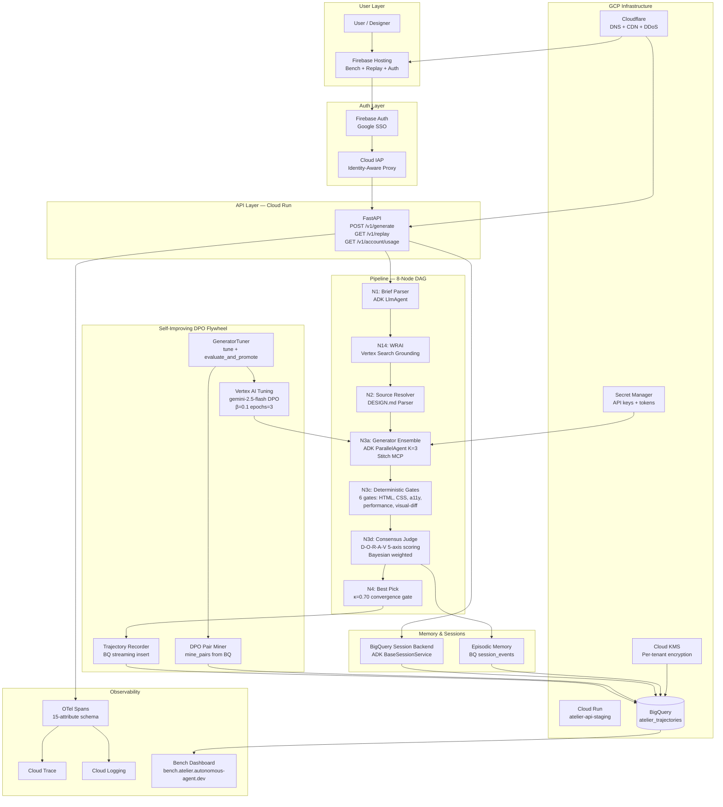

# Atelier Architecture Diagram

> Full system architecture for the Google for Startups AI Agents Challenge 2026 submission.

## System Overview

## Technology Stack

| Layer           | Technology                    | Purpose                             |
| --------------- | ----------------------------- | ----------------------------------- |
| Agent Framework | Google ADK 2.0                | Orchestration, evaluation, sessions |
| Models          | Gemini 2.5 Flash + 3 Pro      | Generation, judgment, DPO tuning    |
| API             | FastAPI on Cloud Run          | REST API + auth middleware          |
| Auth            | Firebase Auth + Cloud IAP     | Google SSO + proxy security         |
| Storage         | BigQuery                      | Trajectories, sessions, DPO pairs   |
| Hosting         | Firebase Hosting + Cloudflare | Dashboards + CDN                    |
| Tuning          | Vertex AI PREFERENCE_TUNING   | DPO fine-tuning pipeline            |
| Observability   | Cloud Trace + Cloud Logging   | OTel spans + structured logs        |
| Secrets         | Secret Manager + KMS          | Keys + per-tenant encryption        |
| Eval            | ADK golden_set.json           | tool_trajectory + rubric scoring    |

## Data Flow

1. **Request**: User submits a design brief through the Firebase-hosted dashboard or API
2. **Authentication**: Firebase Auth verifies Google SSO token → Cloud IAP enforces ingress policy
3. **Pipeline**: FastAPI routes to the 8-node DAG: N1 parses the brief, N14 enriches with web research, N2 resolves source context, N3a generates K=3 candidates via Stitch MCP
4. **Quality gates**: N3c runs 6 deterministic gates (fast, hallucination-free filter) → N3d runs D-O-R-A-V multi-judge consensus on surviving candidates
5. **Convergence**: N4 selects the best candidate if composite score ≥ 0.70 (κ threshold)
6. **Recording**: TrajectoryRecorder streams the full trajectory to BigQuery for DPO pair extraction
7. **Self-improvement**: The DPO Pair Miner extracts preference pairs from accumulated trajectories → GeneratorTuner submits tuning jobs to Vertex AI → promoted adapters feed back into N3a
