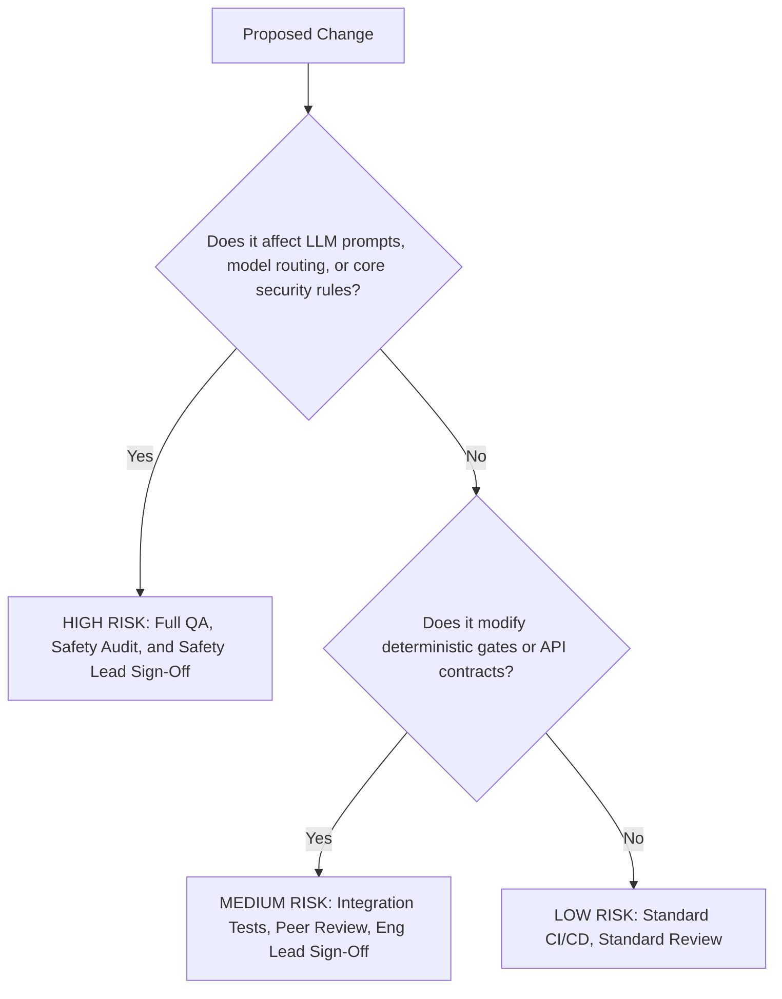

# Change Management and Freeze Window Procedure

This document establishes the official Change Management Procedure for the go-live window and initial production operations of the **Atelier Autonomous Design Agent**.

---

## 1. Objective and Scope

To minimize operational risk, prevent regression, and ensure system stability during the release window, all changes to the Atelier production stack (code, configurations, prompt instructions, and database schemas) must adhere to this procedure.

This procedure applies to:

- All service branches and worktrees of the `atelier` repository.
- The managed Google Cloud resources (Vertex AI pipelines, endpoints, Firestore instances, BigQuery datasets, KMS keys).
- Client-side distribution artifacts (Chrome Extension, Figma Plugin, GitHub Actions).

---

## 2. Release Freeze Windows

To guarantee stability, the launch window is governed by strict code-freeze tiers:

| Freeze Phase                           | Scope of Allowed Changes                                      | Approval Authority                   |
| -------------------------------------- | ------------------------------------------------------------- | ------------------------------------ |
| **Pre-Launch Freeze** (Launch - 72h)   | Critical blocker bug fixes only; zero feature additions.      | Engineering Lead & Security Lead     |
| **Launch Day Freeze** (Launch ± 24h)   | Zero changes permitted, except emergency security hotfixes.   | Executive Sponsor & Security Lead    |
| **Hypercare Freeze** (Launch + 7 days) | Only verified P0/P1 fixes; performance optimization deferred. | Release Board (Eng, Product, Safety) |

---

## 3. Change Risk Classification

All proposed modifications during the freeze window must be categorized and processed based on risk:

### Risk Tier Definitions

#### A. High Risk

- **Definition:** Changes to LLM prompt templates, Model Armor configurations, model routing parameters (`governor.py`), auth rules (`firestore.rules`), or KMS integration.
- **Requirements:**
  1. Full automated test suite verification (`make verify`).
  2. Safety/Responsible-AI team review.
  3. Pre-production staging deployment and validation against the 8-case offline evaluation harness.
  4. Explicit approval from the Safety Lead and Security Lead.

#### B. Medium Risk

- **Definition:** Modifications to deterministic gates (`deterministic.py`, `axe_core.py`), pipeline orchestrator/runner logic (`runner.py`), or data schema versions.
- **Requirements:**
  1. Full automated test suite verification (`make verify`).
  2. Double peer review (at least two Senior Principal Architects).
  3. Pre-production regression testing.
  4. Approval from the Engineering Lead.

#### C. Low Risk

- **Definition:** Documentation updates, UI styling fixes in the dashboard interface, or test fixture enhancements.
- **Requirements:**
  1. Clean CI/CD run.
  2. Single peer review.

---

## 4. Emergency Patch (Hotfix) Procedure

In the event of a production incident (e.g., security breach, loop degradation causing high token usage, critical failure of offline evaluations), the following protocol must be executed:

1. **Declare Incident:** Raise a high-priority incident channel.
2. **Apply Kill-Switch (if applicable):** Use the `MetacognitiveGovernor` token-cap limits or database feature flags to temporarily degrade or disable the affected node rather than letting the agent run out of control.
3. **Develop Fix:** Author the hotfix on a dedicated `hotfix/` branch branched directly from the current production release tag.
4. **Fast-Track Validation:**
   - Run the fast unit test suite locally (`pytest -m "unit and not slow"`).
   - Run the specific test targeting the issue.
5. **Emergency Approval:** Secure verbal/written approval from the Engineering Lead and Security Lead.
6. **Deploy & Post-Mortem:** Deploy the hotfix to production. A full post-mortem must be published within 24 hours of incident resolution.

---

## 5. Rollback Protocols

Every deployment must have a pre-defined rollback plan. If any of the following triggers are met during post-deployment verification:

- **Trigger 1:** High-severity exception rate increases by >1% over baseline.
- **Trigger 2:** Token consumption rate per user exceeds the tier caps.
- **Trigger 3:** Deterministic evaluation pass rate drops below the `0.70` threshold on live sanity checks.

**Rollback Action:** Immediately redeploy the previously tagged stable container image and revert database schema migrations to the last stable state.
