# Autonomous Agent Audit & Local Self-RL Deployment Checklist

> **Audited by**: Claude Opus 4.6 (Thinking) — cross-referencing Gemini 3.5 Flash's prior audit
> **Date**: 2026-05-21
> **Sources**: [autonomous_agent_architecture_research.md](file:///Users/danielmanzela/Downloads/autonomous_agent_architecture_research.md), [Atelier PRD](file:///Users/danielmanzela/Professional%20Profile/Atelier/docs/superpowers/specs/2026-05-14-atelier-prd.md), [REJECTED.md](file:///Users/danielmanzela/Professional%20Profile/Atelier/REJECTED.md), [Gemma 4 Forensic Runbook](file:///Users/danielmanzela/.gemini/antigravity-ide/knowledge/gemma4-vertex-deployment/artifacts/forensic-runbook.md), [AI Agents Challenge Kickoff](file:///Users/danielmanzela/.gemini/antigravity-ide/brain/e9962ddd-ddea-4979-a1d2-fa00102a9019/kickoff_pdf_transcript.txt), [AutonomousAgent SESSION-COMPLETE](file:///Users/danielmanzela/RX-Research%20Project/AutonomousAgent/docs/superpowers/specs/SESSION-COMPLETE-2026-05-15-P1-KICKOFF.md)

---

## Preamble: Gaps Found in Gemini 3.5 Flash Audit

> [!CAUTION]
> The prior audit contained **17 factual errors and omissions** that would have caused build failures, incorrect training submissions, or competition scoring penalties if implemented as-written. Each is catalogued below with its correction.

| #   | Gap                                      | Severity    | What Flash wrote                                           | Correct value                                                                                                                                                                                                                                 | Source                                                  |
| --- | ---------------------------------------- | ----------- | ---------------------------------------------------------- | --------------------------------------------------------------------------------------------------------------------------------------------------------------------------------------------------------------------------------------------- | ------------------------------------------------------- |
| G1  | **Wrong base model**                     | 🔴 Critical | `google/gemma-2-27b-it`                                    | **`google/gemma-4-26b-a4b-it`** (MoE, 26B total / 4B active)                                                                                                                                                                                  | PRD L354, L874; Forensic Runbook §2                     |
| G2  | **Wrong Vertex AI Tuning API**           | 🔴 Critical | `aiplatform.TuningJob.create()`                            | **`aiplatform.CustomJob`** — open-weights models use custom training containers, NOT the managed `TuningJob` API (which is Gemini-only)                                                                                                       | Vertex AI docs; web search confirmed                    |
| G3  | **LoRA status on self-hosted vLLM**      | 🟡 Major    | Implies LoRA works out-of-box                              | LoRA is **BLOCKED on self-hosted vLLM 0.17.2rc1** for Gemma 4 MoE (`get_expert_mapping` missing). BUT: Vertex AI managed tuning (Gemini 2.5 Flash `TuningJob`) **bypasses this entirely**. Forensic Runbook applies to self-hosted path only. | Forensic Runbook §3.6, §3.15, §7; Vertex AI Tuning docs |
| G4  | **gVisor install for macOS**             | 🟡 Major    | `sudo runsc install && sudo systemctl restart docker`      | **gVisor/runsc does NOT run on macOS** — it requires a Linux kernel. macOS Docker Desktop runs in a Linux VM; you must configure Docker's VM, not the host. The `systemctl` command doesn't exist on macOS.                                   | gVisor docs                                             |
| G5  | **Missing competition judging criteria** | 🟡 Major    | Not mentioned                                              | **4 categories: Technical Implementation (30%), Business Case (30%), Innovation & Creativity (20%), Demo & Presentation (20%)**                                                                                                               | Web search confirmed; kickoff slides                    |
| G6  | **Missing competition tracks**           | 🟡 Major    | Not mentioned                                              | **3 tracks: Build (net-new), Optimize (existing → production), Refactor (→ Marketplace + Gemini Enterprise)**. Atelier is **Track 1: Build**.                                                                                                 | Kickoff PDF L123–L136                                   |
| G7  | **Missing `agents-cli` integration**     | 🟡 Major    | Not mentioned                                              | Google's `agents-cli` (`google-agents-cli`) is the recommended scaffold/deploy/eval tool. Kickoff demo uses it extensively. Atelier should integrate or at minimum acknowledge it.                                                            | Kickoff PDF L192–L227; web search                       |
| G8  | **Arize Phoenix in prod**                | 🟡 Major    | Lists Phoenix docker as part of setup                      | **Phoenix is dev-only**. PRD §7.3 and ADR 0006 explicitly reject non-Google observability in production. The audit should not list it as a production component.                                                                              | PRD §7.3; REJECTED.md                                   |
| G9  | **Wrong GCP project ID**                 | 🟡 Major    | `n26-adk-demo` hardcoded                                   | This is the AutonomousAgent's project, NOT Atelier's. Atelier needs its own project.                                                                                                                                                          | AutonomousAgent SESSION-COMPLETE                        |
| G10 | **DPO dataset builder logic flawed**     | 🟡 Major    | Compares `step_index` equality (always true for same step) | A DPO pair must compare **two different completions for the same prompt**, not two steps with the same index. The logic as written would never produce valid pairs.                                                                           | DPO paper; TRL docs                                     |
| G11 | **Missing N1-N15 coverage analysis**     | 🟡 Major    | Only maps C1→N15, C2→N5, etc. (10 mappings)                | **5 Novel Contributions unmapped**: N4 (PADI), N6 (CSC-D), N7 (A2UI), N8 (Calibration Dashboard), N10 (Convergence Spec). These have no research counterpart because they are Atelier-original innovations.                                   | PRD §5                                                  |
| G12 | **Missing Failure Trichotomy**           | 🟡 Major    | Governor only raises exceptions                            | PRD §21 requires every operation to map to exactly one of: **fail-loud / fail-soft / self-heal**. The governor should use this trichotomy.                                                                                                    | PRD §21                                                 |
| G13 | **Missing `adk optimize` (GEPA)**        | 🟢 Minor    | Not mentioned                                              | The Fixer node (N3e) uses `adk optimize` / GEPA for prompt mutation. This is a key ADK 2.0 primitive.                                                                                                                                         | PRD §6.3 N3e                                            |
| G14 | **Missing D-O-R-A-V rubric integration** | 🟢 Minor    | Mentions "structured scalar"                               | Atelier's 5-axis rubric (Brand/Originality/Relevance/Accessibility/Visual-clarity) with per-axis floors is not mentioned.                                                                                                                     | PRD §6.4                                                |
| G15 | **Missing WRAI (N14)**                   | 🟢 Minor    | Not mentioned                                              | Web-Research-Augmented Intake (N14) dispatches 5-8 parallel Vertex AI Search Grounding queries before BriefSpec lock.                                                                                                                         | PRD §6.1 WRAI                                           |
| G16 | **Vertex AI location mismatch**          | 🟢 Minor    | `us-central1`                                              | Forensic runbook uses `us-central1` for Gemma 4 endpoint but PRD mentions europe-west4 as backup. Should be configurable.                                                                                                                     | PRD §19; Runbook §2                                     |
| G17 | **Missing cost-ceiling enforcement**     | 🟢 Minor    | No mention of budget enforcement                           | PRD §7.2 requires per-tenant budget cap at Apigee AI Gateway + Redis token-bucket surge protection.                                                                                                                                           | PRD §7.2                                                |

---

## Part 1: Research Audit & Compatibility Map

The 10 autonomous agent components from the research represent the frontier of recursive, self-improving cognitive architectures. Below is the mapping to **Atelier's** 15 Novel Contributions (N1–N15) and 13 ADRs.

```mermaid
graph TD
    subgraph "Research 10-Component Core"
        C1["C1. Phase-Aware MoE Router"]
        C2["C2. Generator Agent (Agent²)"]
        C3["C3. Hierarchical Memory Manager"]
        C4["C4. Intrinsic Reward Engine"]
        C5["C5. Free Agent Self-Repair"]
        C6["C6. Consensus/Episodic Split"]
        C7["C7. Metacognitive Governor"]
        C8["C8. Protocol Stack (MCP/A2A)"]
        C9["C9. Tiered Sandbox Security"]
        C10["C10. Observability & Trajectory"]
    end

    subgraph "Atelier Novel Contributions"
        N1["N1. DGF-D2C (Det Gates)"]
        N2["N2. DEMAS-D (Provenance)"]
        N3["N3. PerJudge (DPO/LoRA)"]
        N5["N5. EvoDesign (K=6)"]
        N6["N6. CSC-D (Constitution)"]
        N12["N12. RLRD (Long-Running)"]
        N13["N13. PIP (Intake)"]
        N14["N14. WRAI (Research)"]
        N15["N15. MJG (Axis Weighting)"]
    end

    subgraph "Atelier ADRs"
        ADR3["ADR 0003. 5-Tier Sandboxing"]
        ADR6["ADR 0006. Google-Native Only"]
        ADR8["ADR 0008. Multi-Judge Consensus"]
        ADR10["ADR 0010. A2UI Native"]
    end

    C1 --> N15
    C2 --> N5
    C3 --> N3
    C4 --> N1
    C4 --> ADR8
    C5 --> N12
    C6 --> N13
    C7 --> N12
    C8 --> ADR10
    C9 --> ADR3
    C10 --> N3
    C10 --> ADR6
```



### Component Alignment Matrix (Corrected)

| Component                           | Research Spec                                                                               | Atelier Alignment                                                                                                                                                                                   | Gap & Action                                                                                                                                                                                                                                     | Priority      |
| ----------------------------------- | ------------------------------------------------------------------------------------------- | --------------------------------------------------------------------------------------------------------------------------------------------------------------------------------------------------- | ------------------------------------------------------------------------------------------------------------------------------------------------------------------------------------------------------------------------------------------------ | ------------- |
| **C1. Phase-Aware MoE Router**      | Environment-step routing of LoRA experts; aux-loss-free load balancing (DeepSeek-V3 style). | **N15 (MJG)**: Atelier routes through the 8-node DAG with BriefSpec-conditional axis weighting — NOT token-level MoE. The "phase" is the node in the DAG, not a latent variable.                    | **Use ADK 2.0 Graph Workflows** for the 8-node DAG. Token-level MoE is out-of-scope for MVP; the DAG itself IS the router. Phase 4 can add learned expert routing for the judge LoRAs.                                                           | P3 (deferred) |
| **C2. Generator Agent (Agent²)**    | Dual-agent (Generator + Target) with MDP modeling and algorithmic optimization.             | **N5 (EvoDesign)**: K=6 parallel candidates + selection + mutation + crossover. The EvoDesign loop IS the generator-target pattern — but for UI variants, not RL agents.                            | **ADK `CoordinatorAgent`** + `ParallelAgent` for K=6 candidate generation. N3e Fixer (Hebbian mutator via `adk optimize`/GEPA) closes the feedback loop.                                                                                         | P0 (MVP)      |
| **C3. Hierarchical Memory**         | Working/Episodic/Semantic/Procedural layers with virtual context isolation per project.     | **Vertex Memory Bank** (cross-session) + **Firestore** (hot state) + `<project>/.atelier/` (per-project workspace) + **Atelier Skills** (procedural). Vertex Vector Search 2.0 for semantic recall. | **Namespace isolation**: Enforce `tenant_id` + `project_id` partition keys at Memory Bank + Firestore + Vector Search. Use IAM Conditions for session-level access control.                                                                      | P0 (MVP)      |
| **C4. Intrinsic Reward Engine**     | Closed-loop sandbox verification generating synthetic rewards.                              | **N1 (DGF-D2C)**: 6 deterministic gates produce binary pass/fail signals. **N3d ConsensusAgent**: 5 judges produce D-O-R-A-V scores (0.0–1.0 per axis). Combined = **dense, multi-signal reward**.  | **Standardize reward output**: Each judge emits `JudgeVote(score: float, confidence_interval: tuple)`. Composite reward = Bayesian-weighted vote. Write reward to `TrajectoryRecord` for DPO extraction.                                         | P0 (MVP)      |
| **C5. Free Agent (RLFA)**           | Expert lifecycle: Active → Warning → Benched → Probation → Replaced/Reinstated.             | **N12 (RLRD)**: `REJECTED.md` captures failed approaches permanently. Iteration caps prevent runaway loops.                                                                                         | **Hook REJECTED.md into N3e Fixer**: When a mutation operator or prompt pattern is recorded in `REJECTED.md`, inject it as a negative constraint in the Hebbian mutator. Auto-populate REJECTED.md from low-scoring trajectory steps.            | P1 (W2)       |
| **C6. Consensus ↔ Episodic Split**  | Read-Only core (universal rules) vs Read-Write periphery (project-specific).                | **`design-system.lock.md`** = read-only token core. **`@atelier/constitution-apple-grade`** = read-only rules. **`BriefSpec.json`** + `.atelier/` = per-project read-write periphery.               | **Docker volume enforcement**: Mount consensus files as `read_only: true` in container definitions. Validate at runtime that agent cannot mutate locked files.                                                                                   | P0 (MVP)      |
| **C7. Metacognitive Governor**      | MAPE-K loop: Monitor → Analyze → Plan → Execute → Knowledge.                                | **N12 RLRD outer loop**: iteration caps, budget caps, panic exits. PRD §21 Failure Trichotomy.                                                                                                      | **Implement using PRD §21 trichotomy**: fail-loud (kill + alert), fail-soft (degrade + log + acknowledge), self-heal (retry with bounded backoff, max 3 retries). NOT just exception-raising.                                                    | P1 (W2)       |
| **C8. Protocol Stack**              | MCP (Agent-to-Tool) + A2A (Agent-to-Agent).                                                 | **Stitch MCP** + **GitHub MCP** for tools. **A2UI v0.9** for output. ADK 2.0 handles agent-to-agent coordination via `CoordinatorAgent`.                                                            | **A2A Agent Card**: Register Atelier as an A2A-discoverable agent with an Agent Card describing its capabilities. Wire `agents-cli deploy` for managed deployment.                                                                               | P2 (W3)       |
| **C9. Tiered Sandboxing**           | 5-tier isolation hierarchy.                                                                 | **ADR 0003**: `in_process` → `shell_sandbox` → `browser_sandbox` → `external_https` → `cloud_sandbox`.                                                                                              | ⚠️ **macOS limitation**: gVisor/runsc requires Linux kernel. On macOS, Docker Desktop runs a Linux VM — use `--cap-drop=ALL --network=none --read-only` as primary isolation. True gVisor enforcement is for Cloud Run (Linux) deployments only. | P0 (MVP)      |
| **C10. Observability & Trajectory** | OTel GenAI Semantic Conventions + BigQuery trajectory capture + GRPO training pipeline.     | **OTel GenAI semconv** → **Cloud Trace** + **Cloud Monitoring** + **Cloud Logging** + **Vertex AI Studio Tracing**. **BigQuery** for trajectory cold storage.                                       | **OTel span naming**: Use PRD §7.3 attribute schema exactly (`gen_ai.system=atelier`, `atelier.node`, `atelier.iteration`, etc.). Phoenix for local dev ONLY (ADR 0006).                                                                         | P0 (MVP)      |

### Unmapped Atelier-Original Contributions (No Research Counterpart)

These 5 Novel Contributions are **Atelier-original innovations** with no direct counterpart in the 10-component research. They represent Atelier's competitive differentiation:

| Novel Contribution                                   | What makes it unique                                                                   |
| ---------------------------------------------------- | -------------------------------------------------------------------------------------- |
| **N4. PADI** (Project-Agnostic Descriptor Inference) | Adapts to any tech stack via path + intent inference — no per-stack hardcoding         |
| **N7. A2UI-Native Output**                           | First autonomous design agent built A2UI-native from day one                           |
| **N8. Public Calibration Dashboard**                 | First to publish judge calibration as a transparency commitment                        |
| **N10. Convergence Spec RFC**                        | Open standard for how agents declare convergence — Atelier becomes the standard-setter |
| **N11. Open Eval Harness**                           | `bench.atelier.dev` accepts any vendor's agent — ecosystem-defining                    |

---

## Part 2: Competition Strategy Alignment

> [!IMPORTANT]
> The competition has **explicit judging weights** that must drive implementation priority.

### Judging Criteria Mapping

| Criterion                    | Weight  | Atelier's Coverage                                                                                                                          | Risk                                                   |
| ---------------------------- | ------- | ------------------------------------------------------------------------------------------------------------------------------------------- | ------------------------------------------------------ |
| **Technical Implementation** | **30%** | 8-node DAG, 5 judges, 6 det gates, EvoDesign loop, Memory Bank, Vector Search, DPO flywheel, ADK 2.0 graph workflows, OTel observability    | 🟢 Strong — deepest tech stack of any likely entry     |
| **Business Case**            | **30%** | $20/mo Pro tier, per-session unit economics <$0.50, 10× thesis with 7 quantified axes, WebGen-Bench target ≥51.4                            | 🟡 Medium — needs live demo with real business metrics |
| **Innovation & Creativity**  | **20%** | 15 Novel Contributions, 3 publishable papers, first A2UI-native agent, first public judge calibration dashboard, first Convergence Spec RFC | 🟢 Strong — more innovations than any competitor       |
| **Demo & Presentation**      | **20%** | 4-min demo + 2-min backup + 60-sec elevator pitch. Pre-recorded segments for Stitch MCP rate-limit resilience.                              | 🟡 Medium — demo must be flawless. Record by Jun 3.    |

### Competition Track

Atelier is **Track 1: Build** (net-new agent). The kickoff slides show 3 tracks:

1. **Build** — Build net-new agents ← **Atelier**
2. **Optimize** — Optimize existing agents
3. **Refactor** — Refactor for Google Cloud Marketplace & Gemini Enterprise

### `agents-cli` Integration Note

The competition kickoff heavily featured `agents-cli` (`google-agents-cli`). While Atelier uses its own ADK-based build system, we should:

- [ ] Use `agents-cli eval` for the evaluation pipeline (maps to `atelier-eval/`)
- [ ] Use `agents-cli deploy` for Cloud Run deployment (maps to `atelier-deploy/`)
- [ ] Reference `agents-cli scaffold` patterns in project structure
- [ ] Install: `uvx google-agents-cli setup`

### Additional Competition Platform Features (from Kickoff — Not in Flash Audit)

> [!IMPORTANT]
> The kickoff slides prominently feature several Google Cloud platform capabilities that neither the Flash audit nor the PRD mention. While Atelier's PRD is locked, awareness of these is important for **Demo & Presentation** scoring (20%) and showing mastery of the Google Cloud ecosystem.

| Platform Feature                  | Status                                                          | Relevance to Atelier                                                                                                                                               |
| --------------------------------- | --------------------------------------------------------------- | ------------------------------------------------------------------------------------------------------------------------------------------------------------------ |
| **Agent Studio** (Public Preview) | Visual agent + app builder. Can export to ADK for local dev.    | **Demo value**: Show Atelier's ADK code can be imported into Agent Studio for visual debugging. Mention in demo as compatibility proof.                            |
| **Agent Garden**                  | 10+ "atomic" agents as building blocks for multi-agent systems. | **Architecture alignment**: Atelier's 8-node DAG aligns with the "atomic agent" philosophy. Mention during demo that Atelier's nodes ARE composable atomic agents. |
| **Agent Runtime** (Managed)       | Push-to-deploy managed runtime (`agents-cli deploy`).           | **Deployment path**: `agents-cli deploy` targets Agent Runtime. Atelier uses Cloud Run jobs (ADR 0002) but should demonstrate Agent Runtime compatibility.         |
| **Agent Optimizer** (New)         | Google's optimization toolkit for agent performance.            | **N5 EvoDesign alignment**: Mention that Atelier's EvoDesign loop embodies the same optimization principle.                                                        |
| **Agent Anomaly Detection** (New) | Platform-level anomaly detection for agents.                    | **C7 Governor alignment**: Atelier's Metacognitive Governor is the in-agent equivalent.                                                                            |
| **Agent Simulation**              | Testing and validation before production deployment.            | **N11 Open Eval alignment**: `bench.atelier.dev` is Atelier's simulation surface.                                                                                  |

### Submission Q&A — Definitive Answers (from Video Transcript)

> [!CAUTION]
> The video transcript contains **definitive answers** that the PDF slides did not capture. These override any assumptions from the slides.

| Question                       | Answer (from Adi/Jess/Laurel)                                                                                                                      | Impact on Atelier                                                             |
| ------------------------------ | -------------------------------------------------------------------------------------------------------------------------------------------------- | ----------------------------------------------------------------------------- |
| **One or multiple tracks?**    | **"One track for submission"** (video L264, Laurel)                                                                                                | ❌ Atelier CANNOT submit to both Track 1 + Track 2. **Track 1 (Build) only.** |
| **Private repo?**              | Yes — share access instructions. **"Judges are internal Googlers"** (video L262). DevPost won't access code.                                       | ✅ Private repo fine. Ensure judges have GitHub access.                       |
| **Submission platform?**       | **DevPost for Teams** — same platform as registration. Fill project form + link to repo.                                                           | ✅ Prepare DevPost project page by Jun 3.                                     |
| **Credits scope?**             | **Google Cloud Platform products only** — NOT Google AI Studio (video L755, Jess).                                                                 | ✅ All Atelier infra is GCP-native. No issue.                                 |
| **What's "production ready"?** | "Robust, scalable, secure, governable, suitable for real world usage" (video L1266-1282, Adi). Maps to GEAP's Build/Scale/Govern/Optimize pillars. | ✅ PRD already aligns to all 4 pillars.                                       |
| **Internal tools eligible?**   | Yes, IF "packaged and offered up through the cloud marketplace" and "generally useful to other folks" (video L1360-1379, Adi).                     | ✅ Atelier is a SaaS product, not an internal tool.                           |
| **Agent listing criteria?**    | "Solve a clear customer problem, demonstrate robustness, built on agent platform, securely deployed" (video L1410-1440, Adi).                      | ✅ Track 3 potential post-competition.                                        |
| **Timeline changes?**          | "Currently no changes" — deadline remains **June 5th** (video L1849).                                                                              | ✅ No action needed.                                                          |
| **Community forums?**          | **No** — "for IP and privacy reasons" (video L1867-1868).                                                                                          | ⚠️ No community help available.                                               |

### Adi's Key Quotes (Competitive Intelligence)

> "We're seeing over **six trillion tokens** processed monthly through ADK." — Adi (video L490-498)

> "Agent Optimizer creates a **continuous quality flywheel**: observe a failure, simulate a fix, verify the results with data." — Adi (video L1158-1168). **This IS Atelier's convergence loop.**

> "Whether you are using Claude Code or Codex or **Antigravity**, you can use it with one of those coding agents and just have it use the agent CLI." — Adi (video L700-712). **Antigravity explicitly named.**

---

## Part 3: Local Code Integration & Reuse Strategy

The local `AutonomousAgent` codebase (hermes-agent) is a reference implementation. Per **ADR 0001 (wrap-don't-fork)** and the PRD §10 inheritance map, Atelier consumes patterns, NOT code imports.

```
              PATTERN REUSE (adapt architecture, rewrite code)
              ┌────────────────────────────────────┐
              │ • Docker shell-sandbox topology     │
              │ • Tiered sandboxing model           │
              │ • MEMORY/SOUL file patterns         │
              │ • Skills system architecture        │
              │ • Panic/resume primitives           │
              │ • Heartbeat pattern                 │
              │ • Atropos GRPO+LoRA training loop   │
              │ • Telegram approval hook (inline KB) │
              │ • Transcription tools (STT providers)│
              └─────────────┬──────────────────────┘
                            ▼
  ┌────────────────────────────────────────────────────────────┐
  │               ATELIER CORE RUNTIME                         │
  │  google-adk v2.0 Beta + agent-dag-pipeline (pip lockfile)  │
  │  Vertex AI Agent Engine (Sessions + Memory Bank only)      │
  └───────────────────────────▲────────────────────────────────┘
                            │
              REPLACE IN PRODUCTION (ADR 0006)
              ┌────────────────────────────────────┐
              │ ❌ LiteLLM Proxy     → Apigee AI GW│
              │ ❌ Arize Phoenix     → Cloud Trace  │
              │ ❌ Chroma Cloud      → Vertex VS 2.0│
              │ ❌ Honcho User DB    → Firestore    │
              │ ❌ Langfuse          → Vertex Studio │
              │ ❌ Statsig/PostHog   → Firebase RC   │
              └────────────────────────────────────┘
```

### Reusable Patterns from hermes-agent

1. **Transcription Tools** ([transcription_tools.py](file:///Users/danielmanzela/RX-Research%20Project/AutonomousAgent/hermes-agent/tools/transcription_tools.py)): 937-line multi-provider STT with graceful degradation (local faster-whisper → Groq → OpenAI → xAI). Pattern reusable for voice input in Atelier Phase 2.

2. **Shell Sandbox**: `--cap-drop=ALL --network=none` Docker container with writable `/workspace` and read-only host FS. Direct pattern transfer for Atelier's `shell_sandbox` tier.

3. **SOPS-encrypted secrets**: `.sops.yaml` configuration for secret management. Atelier uses Cloud KMS instead but the rotation pattern is transferable.

4. **Plugin architecture**: 30+ YAML-configured plugins across multiple categories (memory, model-providers, web, platforms). Atelier's Skills system mirrors this with `SKILL.md` files.

---

## Part 4: Local Self-RL Deployment Checklist

### 📋 Prerequisites & Local Environment Prep

- [ ] **Python 3.11+** installed via `pyenv` or `uv`:

  ```bash
  # Recommended: uv (Google's choice for agents-cli)
  curl -LsSf https://astral.sh/uv/install.sh | sh
  uv python install 3.11
  ```

- [ ] **Docker Desktop** installed and running on macOS (latest stable)
- [ ] **FFmpeg** installed (for potential video/audio transcription):

  ```bash
  brew install ffmpeg
  ```

- [ ] **Google Cloud CLI (`gcloud`)** authenticated:

  ```bash
  gcloud auth login
  gcloud auth application-default login
  gcloud config set project <ATELIER_PROJECT_ID>  # NOT n26-adk-demo
  ```

- [ ] **Required GCP APIs enabled**:

  ```bash
  gcloud services enable \
    aiplatform.googleapis.com \
    artifactregistry.googleapis.com \
    cloudbuild.googleapis.com \
    cloudtrace.googleapis.com \
    firestore.googleapis.com \
    run.googleapis.com \
    secretmanager.googleapis.com \
    storage.googleapis.com
  ```

- [ ] **`agents-cli` installed** (for eval/deploy integration):

  ```bash
  uvx google-agents-cli setup
  ```

- [ ] **ADK 2.0 Beta installed**:

  ```bash
  pip install google-adk --pre
  ```

> [!WARNING]
> **Do NOT hardcode `n26-adk-demo` as the project ID.** That is the AutonomousAgent project. Atelier needs its own GCP project. Create one via `gcloud projects create atelier-<suffix>` or select an existing one.

---

### 🐳 1. Sandboxing & Security Configuration (C9, ADR 0003)

> [!IMPORTANT]
> **gVisor/runsc does NOT run natively on macOS.** Docker Desktop on macOS runs containers inside a Linux VM (HyperKit/Apple Virtualization). The `runsc` runtime and `systemctl` commands are Linux-only. For local development, use Docker's built-in isolation. For production (Cloud Run on Linux), gVisor is automatically applied.

- [ ] **Create isolated sandbox network**:

  ```bash
  docker network create --internal sandbox_isolated_net
  ```

- [ ] **Docker Compose sandbox definition** — `deploy/docker-compose.dev.yml`:

  ```yaml
  services:
    shell-sandbox:
      build:
        context: .
        dockerfile: Dockerfile.sandbox
      cap_drop:
        - ALL
      security_opt:
        - no-new-privileges:true
      read_only: true
      networks:
        - sandbox_isolated_net
      tmpfs:
        - /tmp:size=256M
      volumes:
        - type: bind
          source: ./workspace
          target: /workspace
          read_only: false
      deploy:
        resources:
          limits:
            cpus: '1.0'
            memory: 2048M
      environment:
        - SANDBOX_TIER=shell_sandbox

    browser-sandbox:
      image: mcr.microsoft.com/playwright:v1.52.0-jammy
      cap_drop:
        - ALL
      security_opt:
        - no-new-privileges:true
      networks:
        - sandbox_net_with_egress
      deploy:
        resources:
          limits:
            cpus: '2.0'
            memory: 4096M

  networks:
    sandbox_isolated_net:
      internal: true # No egress at all
    sandbox_net_with_egress:
      driver: bridge # Egress for browser-sandbox (Playwright needs network)
  ```

- [ ] **Secret scrubber configuration** — `config/scrubber-patterns.yaml`:

  ```yaml
  patterns:
    - name: 'Google API Key'
      regex: 'AIzaSy[A-Za-z0-9\-_]{35}'
    - name: 'GitHub Token'
      regex: 'ghp_[A-Za-z0-9_]{36,255}'
    - name: 'gcloud Service Account Key'
      regex: '"type"\s*:\s*"service_account"'
    - name: 'Generic Secret'
      regex: '(?i)(password|secret|private_key|auth_token|api_key)\s*[:=]\s*["\x27][^"\x27\s]{8,}["\x27]'
    - name: 'JWT Token'
      regex: 'eyJ[A-Za-z0-9\-_]{20,}\.[A-Za-z0-9\-_]{20,}\.[A-Za-z0-9\-_]{20,}'
    - name: 'Vertex AI Endpoint'
      regex: '\d{19}' # 19-digit endpoint IDs
  ```

---

### 🔌 2. Protocol Stack & MCP Setup (C8, ADR 0010)

- [ ] **Stitch MCP** — configured via ADK's `MCPToolset`:

  ```python
  from google.adk.tools import MCPToolset

  stitch_tools = MCPToolset(
      server_uri="https://stitch.googleapis.com/mcp",
      auth_config={"type": "google_default"},  # Uses ADC
  )
  ```

- [ ] **GitHub MCP** — for PR creation and repo metadata:

  ```python
  github_tools = MCPToolset(
      server_uri="http://localhost:8003",  # Local server
      auth_config={"type": "bearer", "token_env": "GITHUB_TOKEN"},
  )
  ```

- [ ] **A2A Agent Card** — `agent_card.json`:

  ```json
  {
    "name": "atelier",
    "version": "1.0.0",
    "description": "Autonomous design agent that converges on flawless UI/UX",
    "skills": [
      { "name": "design-converge", "input": "BriefSpec", "output": "A2UI payload" },
      {
        "name": "campaign-orchestrate",
        "input": "CampaignBrief",
        "output": "Multi-surface convergence"
      }
    ],
    "protocols": ["mcp", "a2a", "a2ui-v0.9"],
    "auth": { "type": "oauth2", "provider": "identity-platform" }
  }
  ```

---

### 📊 3. Observability & Trajectory Collector (C10, ADR 0006)

> [!IMPORTANT]
> Phoenix is **dev-only** (ADR 0006). Production uses Cloud Trace + Vertex AI Studio Tracing.

- [ ] **OTel Collector config** — `config/otel-collector-config.yaml`:

  ```yaml
  receivers:
    otlp:
      protocols:
        grpc:
          endpoint: 0.0.0.0:4317
        http:
          endpoint: 0.0.0.0:4318
  exporters:
    # Dev: console + Phoenix
    logging:
      verbosity: detailed
    otlphttp/phoenix:
      endpoint: http://phoenix:6006/v1/traces
    # Prod: Google Cloud (activate via ATELIER_ENV=production)
    googlecloud:
      project: '${ATELIER_GCP_PROJECT}'
  processors:
    batch:
      timeout: 5s
    attributes:
      actions:
        - key: gen_ai.system
          value: atelier
          action: upsert
  service:
    pipelines:
      traces:
        receivers: [otlp]
        processors: [batch, attributes]
        exporters: [logging, otlphttp/phoenix] # Swap to [googlecloud] in prod
  ```

- [ ] **OTel span attribute schema** (per PRD §7.3):

  ```python
  # Every Atelier span MUST carry these attributes
  ATELIER_SPAN_ATTRS = {
      "gen_ai.system": "atelier",
      "gen_ai.operation.name": str,  # generate_candidate | judge_axis | gate_check | etc.
      "gen_ai.request.model": str,   # e.g. gemini-3-flash, atelier-judge-brand-v3-loraN
      "gen_ai.usage.input_tokens": int,
      "gen_ai.usage.output_tokens": int,
      "gen_ai.usage.cost_usd": float,
      "atelier.tenant_id": str,
      "atelier.project_id": str,
      "atelier.session_id": str,
      "atelier.campaign_id": str,   # nullable
      "atelier.surface_id": str,
      "atelier.node": str,           # e.g. "n3a_generator", "n3c_det_gate"
      "atelier.iteration": int,
      "atelier.candidate_id": str,   # nullable
      "atelier.axis": str,           # nullable, for axis-scoped spans
      "atelier.decision": str,       # PASS | REJECT | CONVERGED | RETRY
      "atelier.score": float,        # nullable
      "atelier.confidence_interval": str,  # JSON "[lo, hi]"
  }
  ```

- [ ] **Local dev visualization** (Phoenix — dev only):

  ```bash
  docker run -d --name phoenix -p 6006:6006 arizephoenix/phoenix:latest
  ```

---

### 💾 4. Memory Split Configuration (C6 + C3)

- [ ] **Per-project directory structure** (mirrors PRD §6.2):

  ```bash
  mkdir -p ./workspace/.atelier/{checkpoints,trajectories}
  ```

- [ ] **Consensus core files** (read-only):

  ```
  consensus/
  ├── DESIGN_PRINCIPLES_APPLE.md        # 12-principle constitution (N6 CSC-D)
  ├── constitution-apple-grade/          # npm package source
  │   └── index.json
  ├── axis_weights_heuristic.yaml       # N15 MJG per-register weighting
  └── research-trust.yaml               # N14 WRAI domain whitelist/denylist
  ```

- [ ] **Docker mount enforcement** — consensus as read-only:

  ```yaml
  # In docker-compose.dev.yml
  volumes:
    - type: bind
      source: ./consensus
      target: /consensus
      read_only: true # Agent CANNOT modify
    - type: bind
      source: ./workspace
      target: /workspace
      read_only: false # Agent CAN modify
  ```

---

### 🧠 5. Self-RL Fine-Tuning Pipeline Setup (C4 + C10)

> [!IMPORTANT]
> **Model & LoRA Path Decision Matrix** (corrected per user feedback):
>
> The Forensic Runbook documents ONE deployment path (self-hosted vLLM). It is **reference only, not authoritative** for all paths.
> The model choice is NOT locked — any Model Garden model on GEAP is viable. Here are the options:
>
> | Option              | Model                  | Tuning API                               | Serving                                  | Status                                               |
> | ------------------- | ---------------------- | ---------------------------------------- | ---------------------------------------- | ---------------------------------------------------- |
> | **A (Recommended)** | **Gemini 2.5 Flash**   | Managed `TuningJob.create()` — SFT + DPO | Vertex AI Endpoints (managed)            | ✅ GA, zero-infra                                    |
> | **B**               | **Gemma 4 26B-A4B-it** | Custom `CustomJob` (TRL + PEFT + LoRA)   | Vertex AI Endpoints (managed containers) | ✅ Training works; managed serving may fix MoE LoRA  |
> | **C**               | **Gemini 3.1 Pro**     | Managed TuningJob                        | Vertex AI Endpoints                      | ⚠️ SFT/DPO not yet GA (May 2026); check before Jun 3 |
> | **D**               | **Gemma 4 via VTC**    | NeMo Megatron distributed                | Vertex AI Endpoints                      | ✅ Full MoE support                                  |
>
> **Recommendation**: Start with **Option A (Gemini 2.5 Flash)** for MVP — fully managed, no custom containers, DPO supported.
> The DPO dataset builder below works for ANY model; only the training submission script changes.

- [ ] **Trajectory Recorder** — `lib/flywheel/trajectory_recorder.py`:

  ```python
  """Records agent execution steps as JSONL for DPO dataset extraction.

  Each record maps to the PRD's TrajectoryRecord Pydantic model (§9).
  """
  import json
  import time
  import uuid
  from pathlib import Path
  from typing import Optional


  class TrajectoryRecorder:
      def __init__(
          self,
          session_id: str,
          tenant_id: str,
          project_id: str,
          surface_id: str,
          output_dir: str = "./workspace/.atelier/trajectories",
      ):
          self.session_id = session_id
          self.tenant_id = tenant_id
          self.project_id = project_id
          self.surface_id = surface_id
          self.filepath = Path(output_dir) / f"{session_id}.jsonl"
          self.filepath.parent.mkdir(parents=True, exist_ok=True)

      def record_step(
          self,
          node_name: str,
          iteration: int,
          candidate_id: str,
          prompt: str,
          response: str,
          gate_outcomes: list[dict],
          judge_votes: list[dict],
          composite_score: float,
          cost_usd: float,
          user_signal: Optional[str] = None,
      ):
          """Record a single trajectory step aligned to PRD TrajectoryRecord schema."""
          payload = {
              "trajectory_id": str(uuid.uuid4()),
              "tenant_id": self.tenant_id,
              "project_id": self.project_id,
              "session_id": self.session_id,
              "surface_id": self.surface_id,
              "ts": time.time(),
              "node_name": node_name,
              "iteration": iteration,
              "candidate_id": candidate_id,
              "prompt": prompt,
              "response": response,
              "gate_outcomes": gate_outcomes,
              "judge_votes": judge_votes,
              "composite_score": composite_score,
              "cost_usd": cost_usd,
              "user_signal": user_signal,  # "accept" | "reject" | None
          }
          with open(self.filepath, "a", encoding="utf-8") as f:
              f.write(json.dumps(payload) + "\n")
  ```

- [ ] **DPO Dataset Generator** — `scripts/prepare_dpo_dataset.py`:

  ```python
  """Builds DPO preference pairs from trajectory logs.

  A valid DPO pair requires:
  1. Same prompt (same node + iteration + surface context)
  2. Different completions (different candidates)
  3. Clear quality margin (composite_score difference >= 0.15)

  This follows the 3-tier flywheel from PRD §6.6:
    T1 (production-baseline) → all sessions
    T2 (quality-approved) → D-O-R-A-V >= 0.7 AND all det gates pass → "chosen"
    T3 (failure-cases) → D-O-R-A-V < 0.5 OR any det gate fails → "rejected"
  """
  import json
  import glob
  from collections import defaultdict
  from pathlib import Path

  CHOSEN_THRESHOLD = 0.7    # T2: quality-approved
  REJECTED_THRESHOLD = 0.5  # T3: failure-cases
  MIN_MARGIN = 0.15         # PRD §6.6: margin >= 0.15


  def build_dpo_dataset(trajectory_dir: str, output_file: str):
      pairs = []
      # Group steps by (surface_id, node_name, iteration) = same decision point
      decision_groups = defaultdict(list)

      for path in glob.glob(f"{trajectory_dir}/*.jsonl"):
          with open(path, "r", encoding="utf-8") as f:
              for line in f:
                  step = json.loads(line)
                  key = (
                      step["surface_id"],
                      step["node_name"],
                      step["iteration"],
                  )
                  decision_groups[key].append(step)

      # For each decision point, find chosen/rejected pairs across candidates
      for key, steps in decision_groups.items():
          if len(steps) < 2:
              continue

          # Sort by composite_score descending
          steps.sort(key=lambda s: s["composite_score"], reverse=True)

          for i, chosen in enumerate(steps):
              if chosen["composite_score"] < CHOSEN_THRESHOLD:
                  break  # No more "chosen" quality candidates
              for rejected in steps[i + 1:]:
                  if rejected["composite_score"] >= REJECTED_THRESHOLD:
                      continue  # Not bad enough to be "rejected"
                  margin = chosen["composite_score"] - rejected["composite_score"]
                  if margin < MIN_MARGIN:
                      continue
                  pairs.append({
                      "prompt": chosen["prompt"],
                      "chosen": chosen["response"],
                      "rejected": rejected["response"],
                      "margin": round(margin, 3),
                      "surface_id": chosen["surface_id"],
                      "node_name": chosen["node_name"],
                      "iteration": chosen["iteration"],
                  })

      output_path = Path(output_file)
      output_path.parent.mkdir(parents=True, exist_ok=True)
      with open(output_path, "w", encoding="utf-8") as f:
          for pair in pairs:
              f.write(json.dumps(pair) + "\n")
      print(f"Created DPO dataset: {len(pairs)} preference pairs → {output_file}")


  if __name__ == "__main__":
      build_dpo_dataset(
          "./workspace/.atelier/trajectories",
          "./workspace/.atelier/dpo_train.jsonl",
      )
  ```

- [ ] **Vertex AI Custom Training Submission** — `scripts/submit_vertex_training.py`:

  > [!CAUTION]
  > Open-weights models like Gemma 4 use **`CustomJob`**, NOT the managed `TuningJob` API.
  > The `TuningJob.create(base_model=...)` API is for proprietary models (Gemini) only.
  > LoRA on Gemma 4 26B-A4B-it is currently **blocked** at serving time (vLLM MoE incompatibility).
  > This script trains the adapter — serving it requires either:
  > (a) Vertex AI Endpoints with Multi-Tuning Manager (if MoE adapter support ships), or
  > (b) A custom vLLM build with `get_expert_mapping()` patched for Gemma 4.

  ```python
  """Submit a DPO/LoRA fine-tuning job for Gemma 4 26B-A4B-it on Vertex AI.

  Uses CustomJob (NOT TuningJob) because Gemma 4 is an open-weights model.
  The training script runs inside a custom container with TRL + PEFT.
  """
  from google.cloud import aiplatform


  def submit_dpo_training(
      project: str,
      region: str = "us-central1",
      staging_bucket: str = "gs://atelier-training-staging",
      train_dataset_gcs: str = "gs://atelier-training-staging/dpo_train.jsonl",
      container_image: str = "",  # Your Artifact Registry image
  ):
      aiplatform.init(project=project, location=region, staging_bucket=staging_bucket)

      # Custom training job — NOT TuningJob.create()
      job = aiplatform.CustomJob(
          display_name="atelier-judge-dpo-lora",
          worker_pool_specs=[
              {
                  "machine_spec": {
                      "machine_type": "a2-ultragpu-1g",
                      "accelerator_type": "NVIDIA_A100_80GB",
                      "accelerator_count": 1,
                  },
                  "replica_count": 1,
                  "container_spec": {
                      "image_uri": container_image,
                      "args": [
                          "--model_name", "google/gemma-4-26b-a4b-it",
                          "--dataset_path", "/gcs/dpo_train.jsonl",
                          "--output_dir", "/gcs/output/",
                          "--lora_r", "32",
                          "--lora_alpha", "64",
                          "--lora_target_modules", "q_proj,v_proj",
                          "--num_epochs", "3",
                          "--per_device_train_batch_size", "1",
                          "--gradient_accumulation_steps", "8",
                          "--learning_rate", "5e-5",
                          "--bf16", "true",
                          "--method", "dpo",
                          "--dpo_beta", "0.1",
                      ],
                  },
              }
          ],
      )

      job.run(sync=False)
      print(f"Training job submitted: {job.resource_name}")
      print(f"Monitor: https://console.cloud.google.com/vertex-ai/training/{job.resource_name}")


  if __name__ == "__main__":
      submit_dpo_training(
          project="<ATELIER_PROJECT_ID>",
          container_image="<REGION>-docker.pkg.dev/<PROJECT>/atelier-training/dpo-trainer:latest",
      )
  ```

- [ ] **DPO Training Container** — `deploy/training/Dockerfile.dpo`:

  ```dockerfile
  FROM pytorch/pytorch:2.4.0-cuda12.4-cudnn9-devel

  RUN pip install --no-cache-dir \
      transformers>=4.45.0 \
      peft>=0.13.0 \
      trl>=0.12.0 \
      accelerate>=0.34.0 \
      bitsandbytes>=0.44.0 \
      datasets \
      google-cloud-storage

  COPY train_dpo.py /app/train_dpo.py
  WORKDIR /app
  ENTRYPOINT ["python", "train_dpo.py"]
  ```

---

### 🚨 6. Metacognitive Governor (C7, PRD §21)

Uses the **Failure Trichotomy** from PRD §21 — every operation maps to exactly one of: fail-loud, fail-soft, or self-heal.

- [ ] **Governor class** — `lib/durability/governor.py`:

  ```python
  """Metacognitive Governor implementing PRD §21 Failure Trichotomy.

  Monitors agent execution and applies MAPE-K-style corrections:
    Monitor → Analyze → Plan → Execute → Knowledge

  Every detected issue maps to exactly one of:
    - fail-loud: Security/budget/data-corruption → alert + halt
    - fail-soft: Tool/transient errors → degrade + log + acknowledge to user
    - self-heal: 429/503 → retry with bounded backoff (max 3)
  """
  import hashlib
  import logging
  import time
  from dataclasses import dataclass, field
  from enum import Enum
  from typing import Optional

  logger = logging.getLogger("atelier.governor")


  class FailureMode(Enum):
      FAIL_LOUD = "fail_loud"
      FAIL_SOFT = "fail_soft"
      SELF_HEAL = "self_heal"


  class GovernorAlert(Exception):
      """Raised on fail-loud conditions. Agent MUST halt."""
      def __init__(self, message: str, failure_mode: FailureMode):
          super().__init__(message)
          self.failure_mode = failure_mode


  @dataclass
  class ToolCall:
      tool_name: str
      arguments_hash: str
      timestamp: float


  @dataclass
  class GovernorConfig:
      max_consecutive_identical_calls: int = 3
      max_total_steps: int = 50
      max_cost_usd: float = 5.0
      self_heal_max_retries: int = 3
      context_exhaustion_threshold: float = 0.9
      stall_detection_window: int = 10


  class MetacognitiveGovernor:
      def __init__(self, config: Optional[GovernorConfig] = None):
          self.config = config or GovernorConfig()
          self.tool_history: list[ToolCall] = []
          self.total_cost_usd: float = 0.0
          self.retry_counts: dict[str, int] = {}
          self.progress_markers: list[bool] = []

      def register_tool_call(
          self,
          tool_name: str,
          arguments: dict,
          cost_usd: float = 0.0,
          made_progress: bool = True,
      ):
          """Register a tool call and run all health checks."""
          args_hash = hashlib.md5(
              str(sorted(arguments.items())).encode()
          ).hexdigest()
          self.tool_history.append(ToolCall(tool_name, args_hash, time.time()))
          self.total_cost_usd += cost_usd
          self.progress_markers.append(made_progress)

          self._check_budget()
          self._check_step_budget()
          self._check_infinite_loop()
          self._check_stall()

      def _check_budget(self):
          """fail-loud: Budget breach is a security event."""
          if self.total_cost_usd > self.config.max_cost_usd:
              raise GovernorAlert(
                  f"Budget exceeded: ${self.total_cost_usd:.2f} > "
                  f"${self.config.max_cost_usd:.2f}. Halting.",
                  FailureMode.FAIL_LOUD,
              )

      def _check_step_budget(self):
          """fail-soft: Step budget exhaustion degrades gracefully."""
          if len(self.tool_history) > self.config.max_total_steps:
              logger.warning(
                  "Step budget exhausted (%d/%d). Entering degraded mode.",
                  len(self.tool_history),
                  self.config.max_total_steps,
              )
              raise GovernorAlert(
                  f"Step budget exhausted ({len(self.tool_history)} steps). "
                  "Returning best partial result.",
                  FailureMode.FAIL_SOFT,
              )

      def _check_infinite_loop(self):
          """fail-soft: Identical tool calls detected → break loop."""
          n = self.config.max_consecutive_identical_calls
          if len(self.tool_history) < n:
              return
          recent = self.tool_history[-n:]
          fingerprints = {f"{c.tool_name}:{c.arguments_hash}" for c in recent}
          if len(fingerprints) == 1:
              logger.warning(
                  "Infinite loop detected: %s called %d times with identical args.",
                  recent[0].tool_name, n,
              )
              raise GovernorAlert(
                  f"Infinite loop: {recent[0].tool_name} called {n}× "
                  "with identical arguments. Breaking loop.",
                  FailureMode.FAIL_SOFT,
              )

      def _check_stall(self):
          """fail-soft: No progress in last N steps."""
          window = self.config.stall_detection_window
          if len(self.progress_markers) < window:
              return
          recent_progress = self.progress_markers[-window:]
          if not any(recent_progress):
              logger.warning(
                  "Stall detected: no progress in last %d steps.", window
              )
              raise GovernorAlert(
                  f"No progress in last {window} steps. "
                  "Returning best partial result.",
                  FailureMode.FAIL_SOFT,
              )

      def should_self_heal(self, operation_key: str) -> bool:
          """self-heal: Check if retry budget remains for this operation."""
          count = self.retry_counts.get(operation_key, 0)
          if count >= self.config.self_heal_max_retries:
              return False
          self.retry_counts[operation_key] = count + 1
          return True
  ```

---

### 📐 7. D-O-R-A-V Rubric — Task-Aware Model Routing (N1 + N2 + N3d)

> [!IMPORTANT]
> **Principle**: Don't use one model for all judges. Match each judge axis to the model whose **strengths best fit the task** — the Perplexity Computer "Model Council" approach. This is a 2026 industry standard: task decomposition → model-task fit → parallel execution → synthesis.

#### Judge Anti-Bias Rules (2026 Best Practices)

1. **No family-self-preference**: Never use the same model family for generator AND judge — judges exhibit strong self-preference bias. Since Stitch MCP (Gemini-based) generates candidates, use a **different model family or different Gemini variant** for each judge to minimize self-scoring.
2. **CoT before score**: Every judge outputs `reasoning` BEFORE `score` (already in `JudgeVote.reasoning` field).
3. **Position swap**: For pairwise comparisons, swap A/B order and average to neutralize position bias.
4. **Gold set calibration**: Maintain 200-500 human-labeled examples per axis; target Cohen's κ ≥ 0.7.

#### Task-Aware Model Assignment

| Axis                   | Task Characteristics                                                                                                                                                           | Best-Fit Model                                                           | Why This Model                                                                                                                                                            | Floor | LoRA Path                            | Cost/1M tokens                |
| ---------------------- | ------------------------------------------------------------------------------------------------------------------------------------------------------------------------------ | ------------------------------------------------------------------------ | ------------------------------------------------------------------------------------------------------------------------------------------------------------------------- | ----- | ------------------------------------ | ----------------------------- |
| **D** (Brand-fidelity) | **Multimodal vision** — must compare rendered screenshot against DESIGN.md tokens (colors, fonts, spacing). Requires pixel-level cross-referencing.                            | **Gemini 3 Flash** (vision mode)                                         | Superior multimodal vision + low-quality image handling. Best at cross-referencing visual output against text specifications.                                             | 0.7   | ✅ DPO via managed TuningJob         | ~$0.15/1M in                  |
| **O** (Originality)    | **Creative reasoning** — must assess novelty, memorability, differentiation from templates. Requires deep aesthetic judgment, NOT pattern matching.                            | **Gemini 2.5 Pro** (thinking mode)                                       | 2M context + deep reasoning = best for subjective aesthetic judgment that requires weighing multiple creative factors. Most "thoughtful" model for non-quantifiable axes. | 0.6   | ❌ (subjective axis, hard to DPO)    | ~$1.25/1M in                  |
| **R** (Relevance)      | **Grounding + retrieval** — must verify that UI content is actually relevant to the BriefSpec's stated purpose, audience, and industry. Needs fact-checking against brief.     | **Gemini 3 Flash** + **Vertex AI Search Grounding**                      | Flash's speed + built-in grounding for fact-checking content against the BriefSpec. Can verify claims, check industry appropriateness.                                    | 0.7   | ✅ DPO via managed TuningJob         | ~$0.15/1M in                  |
| **A** (Accessibility)  | **Deterministic + model hybrid** — Lighthouse/axe-core (binary det gate) is authoritative; the model judge adds nuance (e.g., cognitive load, reading level, color semantics). | **Det gate** (authoritative) + **Gemini 3.1 Flash-Lite** (supplementary) | Flash-Lite is cheapest ($0.25/1M) — a11y nuance doesn't need frontier reasoning. Det gate handles the hard constraints; model only adds soft signals.                     | 0.8   | ❌ (det gate is ground truth)        | ~$0.25/1M in                  |
| **V** (Visual-clarity) | **Multimodal embedding** — must assess visual hierarchy, whitespace, typography, layout balance. Benefits from embedding similarity between screenshot and "ideal" patterns.   | **Gemini 3 Flash** (vision) + **Gemini Embedding 2** (multimodal)        | Flash for CoT visual assessment + Gemini Embedding 2 for cosine similarity against visual-clarity exemplar set. Two-signal approach.                                      | 0.7   | ❌ (embedding-based, not generative) | ~$0.15/1M in + $0.10/1M embed |

#### Cost Analysis (per surface, 5-judge consensus)

| Scenario                       | Token Estimate                                      | Cost                   |
| ------------------------------ | --------------------------------------------------- | ---------------------- |
| **All Gemini 3 Flash** (naïve) | ~50K tokens × 5 judges                              | ~$0.04                 |
| **Task-routed** (above)        | ~50K Flash × 3 + ~50K Pro × 1 + ~50K Flash-Lite × 1 | ~$0.10                 |
| **Delta**                      | —                                                   | +$0.06/surface (+150%) |

> [!TIP]
> The +$0.06 per surface is negligible at scale. A 12-surface campaign costs ~$1.20 total for judges. Budget permits ~4,000 campaigns within the $5K ceiling (judges only). **Model quality >> cost savings** for competition scoring.

#### Model Routing Implementation (ADK 2.0 Pattern)

```python
# Judge model routing config — BriefSpec-conditional (N15 MJG)
JUDGE_MODEL_CONFIG = {
    "brand": {
        "model": "gemini-3-flash",
        "mode": "vision",  # Screenshot + DESIGN.md comparison
        "tunable": True,
        "tuning_model": "gemini-2.5-flash-001",  # DPO target
    },
    "originality": {
        "model": "gemini-2.5-pro",
        "mode": "thinking",  # Deep aesthetic reasoning
        "tunable": False,  # Subjective axis — hard to build DPO pairs
    },
    "relevance": {
        "model": "gemini-3-flash",
        "mode": "grounded",  # Vertex AI Search Grounding enabled
        "tunable": True,
        "tuning_model": "gemini-2.5-flash-001",
    },
    "accessibility": {
        "model": "gemini-3.1-flash-lite",
        "mode": "supplementary",  # Det gate is authoritative
        "tunable": False,
    },
    "visual_clarity": {
        "model": "gemini-3-flash",
        "mode": "vision+embedding",  # Screenshot + exemplar similarity
        "embedding_model": "gemini-embedding-2",
        "tunable": False,
    },
}
```

**N15 MJG (Metastrategic Judging Gap)**: Floors and weights are derived from `BriefSpec.visual_register × compliance_level × convergence_bar`:

- Data-viz dashboard → a11y + visual-clarity weighted higher
- Marketing landing page → brand-fidelity + originality weighted higher
- Brutalist register → brand-fidelity floor lowered in service of memorability

---

### 🔄 8. End-to-End Pipeline Verification

After completing the checklist above, verify the pipeline with this sequence:

```bash
# 1. Verify Docker sandbox
docker compose -f deploy/docker-compose.dev.yml up -d
docker exec shell-sandbox whoami  # Should NOT be root
docker exec shell-sandbox ping google.com  # Should FAIL (no network)

# 2. Verify OTel collector
curl -s http://localhost:4318/v1/traces  # Should accept POST

# 3. Verify consensus file is read-only
docker exec shell-sandbox touch /consensus/test.txt  # Should FAIL

# 4. Run trajectory recorder test
python -c "
from lib.flywheel.trajectory_recorder import TrajectoryRecorder
tr = TrajectoryRecorder('test-session', 'tenant-1', 'proj-1', 'surface-1')
tr.record_step('n3a_generator', 0, 'cand-1', 'test prompt', 'test response',
               [{'axis': 'lighthouse_a11y', 'decision': 'PASS'}],
               [{'axis': 'brand', 'score': 0.85}], 0.85, 0.01)
print('✅ Trajectory recorder works')
"

# 5. Run DPO dataset builder test
python scripts/prepare_dpo_dataset.py

# 6. Verify agents-cli setup
uvx google-agents-cli --version
```

---

## Part 5: Known Risks & Mitigations

| Risk                                                            | Probability | Impact | Mitigation                                                                                                                                                         |
| --------------------------------------------------------------- | ----------- | ------ | ------------------------------------------------------------------------------------------------------------------------------------------------------------------ |
| **Self-hosted Gemma 4 LoRA blocked** (vLLM MoE incompatibility) | Medium      | Low    | **Mitigated**: Use Gemini 2.5 Flash via managed `TuningJob` for MVP judges. Self-hosted Gemma 4 LoRA is Phase 2. Forensic Runbook is reference-only for that path. |
| **Stitch MCP rate-limited during demo**                         | High        | Medium | Pre-recorded backup demo segments; fallback to direct Gemini generation.                                                                                           |
| **Vertex AI Endpoints quota denied**                            | Medium      | High   | File quota request early (PRD P-3, P-4). Use Cloud Run + custom vLLM as fallback.                                                                                  |
| **agents-cli breaking changes**                                 | Medium      | Low    | Pin version in `requirements.lock`. The CLI is still in alpha.                                                                                                     |
| **Cost overrun on $5K budget**                                  | Medium      | Medium | Daily cost ledger; cache-hit-rate monitoring (target ≥85%); downgrade routine work to Flash-Lite.                                                                  |
| **gVisor unavailable in Cloud Run**                             | Low         | Medium | Cloud Run already uses gVisor by default. No action needed.                                                                                                        |
| **DPO training produces worse judge**                           | Medium      | Medium | A/B eval against baseline before promoting LoRA. Auto-register only if eval improves ≥2%.                                                                          |

---

## Part 6: Model Tuning Deployment — Options & Constraints

> [!NOTE]
> The [Forensic Runbook](file:///Users/danielmanzela/.gemini/antigravity-ide/knowledge/gemma4-vertex-deployment/artifacts/forensic-runbook.md) documents a **specific self-hosted vLLM deployment attempt** for Gemma 4. It is a **reference** for that path, NOT the authoritative document for all deployment paths. Vertex AI's managed tuning and serving stack may resolve all documented issues.

### Path A: Vertex AI Managed Tuning (Recommended for MVP)

Use `TuningJob.create()` with **Gemini 2.5 Flash** — the simplest path with zero custom infrastructure:

```python
from google.cloud import aiplatform

job = aiplatform.TuningJob.create(
    source_model="gemini-2.5-flash-001",
    training_dataset="gs://atelier-data/dpo_train.jsonl",
    tuned_model_display_name="atelier-judge-brand-v1",
    tuning_task_type="DPO",  # or "SFT"
    hyperparameters={
        "epoch_count": 3,
        "learning_rate_multiplier": 1.0,
    },
)
```

**Advantages**: Fully managed, no custom containers, DPO supported natively, Vertex AI Endpoints auto-provisioned.

### Path B: Custom Training for Gemma 4 (Phase 2 / Post-MVP)

For open-weights models (Gemma 4 26B-A4B-it), use `CustomJob` with TRL/PEFT/LoRA:

- Training via Custom Training Job works
- Serving via Vertex AI managed containers — **verify** if the managed vLLM image supports Gemma 4 MoE LoRA adapters (the self-hosted attempt was blocked, but Google's managed image may have a newer vLLM version)

### Forensic Runbook Constraints (Reference — Self-Hosted Path Only)

These constraints apply ONLY to the self-hosted vLLM deployment path (not managed Vertex AI):

| Constraint             | Detail                            | Applies to managed?                     |
| ---------------------- | --------------------------------- | --------------------------------------- |
| BF16 only              | NF4/AWQ/GPTQ fail on MoE          | ❓ Unknown — managed may differ         |
| LoRA blocked           | `get_expert_mapping()` missing    | ❓ Managed vLLM image may be newer      |
| Dependency triangle    | vLLM + transformers + hub locked  | ❌ Not relevant (managed stack)         |
| Stop token client-side | `stop_token_ids: [106]` mandatory | ✅ Still applies to any Gemma 4 serving |
| Chat template          | No Jinja2 `namespace()`           | ✅ Still applies to any custom serving  |

### MVP Recommendation

**Use Gemini 2.5 Flash** via managed `TuningJob` for the 5 judge LoRAs in MVP. This:

- ✅ Bypasses all Forensic Runbook constraints
- ✅ Fully managed (no Dockerfile, no vLLM, no GPU quota management)
- ✅ DPO natively supported
- ✅ Scores well on "Use of Google Cloud" judging criterion (30% weight)

The Gemma 4 open-weights path remains viable for Phase 2 differentiation (demonstrate open model mastery).

---

## Appendix A: Full Novel Contribution → Component Map

| Novel Contribution        | Research Components Used                     | Status                         |
| ------------------------- | -------------------------------------------- | ------------------------------ |
| N1. DGF-D2C               | C4 (reward engine provides gate signals)     | P0                             |
| N2. DEMAS-D               | C4 (provenance-scoped reward)                | P0                             |
| N3. PerJudge              | C3 (memory), C4 (reward), C10 (trajectory)   | P0 (DPO proof); P2 (full LoRA) |
| N4. PADI                  | — (Atelier-original)                         | P0                             |
| N5. EvoDesign             | C2 (generator agent pattern)                 | P0                             |
| N6. CSC-D                 | C6 (consensus core = constitution)           | P0                             |
| N7. A2UI-Native           | C8 (protocol stack)                          | P0                             |
| N8. Calibration Dashboard | C10 (observability feeds dashboard)          | P2                             |
| N9. Open Eval Adapters    | C10 (trajectory format)                      | P2                             |
| N10. Convergence Spec     | — (Atelier-original)                         | P3                             |
| N11. Open Eval Harness    | C10 (trajectory pipeline)                    | P3                             |
| N12. RLRD                 | C5 (self-repair), C7 (governor)              | P0                             |
| N13. PIP                  | C6 (consensus/episodic boundary = BriefSpec) | P0                             |
| N14. WRAI                 | C3 (memory), C8 (protocol for web search)    | P1                             |
| N15. MJG                  | C1 (routing = axis weight modulation)        | P0                             |
